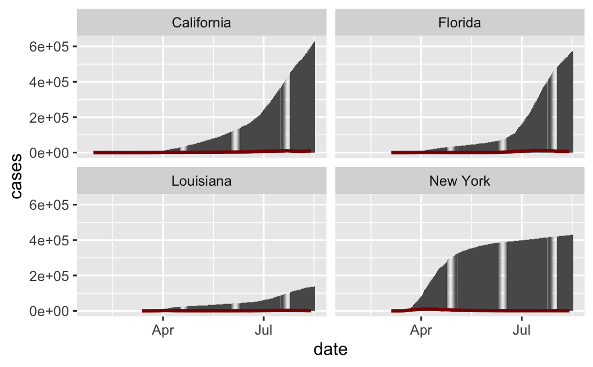

#Question 1
```{R,message=FALSE,warning=FALSE}
library(tidyverse)
library(knitr)
library(readxl)
library(zoo)

pop = read_excel('../data/PopulationEstimates.xls',skip = 2)%>%
  select(pop2019 = POP_ESTIMATE_2019, fips = FIPStxt)

url = 'https://raw.githubusercontent.com/nytimes/covid-19-data/master/us-counties.csv'
covid = read_csv(url)

state1 = 'California'

newdata = inner_join(pop, covid, by = 'fips')%>%
  filter(state == state1)%>%
  group_by(county)%>%
  mutate(new_cases = cases - lag(cases))
```

cumulative cases in the 5 worst counties
```{R,message=FALSE,warning=FALSE}
worst = newdata%>%
  group_by(county)%>%
  summarise(cases = sum(cases, na.rm = TRUE))%>%
  ungroup()%>%
  arrange(-cases)%>%
  slice_max(cases,n = 5)

knitr::kable(worst, caption = paste(state1, 'counties with most cumulative cases'), col.names = c('county', 'cases'))
```

5 counties with most new cases
```{R,message=FALSE,warning=FALSE}
newcases = newdata%>%
  select(county, new_cases)%>%
  group_by(county)%>%
  summarise(new_cases = sum(new_cases, na.rm = TRUE))%>%
  arrange(-new_cases)%>%
  slice_max(new_cases, n = 5)

knitr::kable(newcases, caption = paste(state1, 'counties with most new cases'), col.names = c('county','New Cases'))
```

The California Department of Public Health maintains a watch list of counties that are being monitored for worsening coronavirus trends. Thre are 13 counties that are concerned to be safe based on their criteria.
```{R, message = TRUE, warning = FALSE}
day14 = newdata%>%
  filter(date > max(date) - 13)%>%
  group_by(county, pop2019)%>%
  summarise(new_cases = sum(new_cases))%>%
  ungroup()%>%
  mutate(caseper100 = new_cases / (pop2019 / 100000))%>%
  filter(caseper100 <= 100)%>%
  pull(county)
```


#Question 2
```{R,message=FALSE,warning=FALSE}
fourstate = covid%>%
  group_by(state, date)%>%
  summarise(cases = sum(cases))%>%
  ungroup()%>%
  filter(state %in% c("California","New York","Florida","Louisiana"))%>%
  group_by(state)%>%
  mutate(newcases = cases - lag(cases))%>%
  ungroup()%>%
  mutate(avg = rollmean(newcases,7,fill=NA,allign='right'))
```

```{R,message=FALSE,warning=FALSE}
ggplot(data = fourstate, aes(x = date))+
  geom_col(aes(y = cases))+
  facet_wrap(~state)+
  geom_line(aes(y = avg), col = "darkred", size = 1)
```



